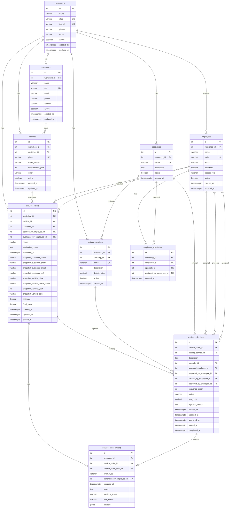

# AutoManager — Arquitetura

Documento de referência técnica para desenvolvedores e agentes de IA.

> **Última revisão de arquitetura:** 2026-07-10 (rev. 2) — modelo multi-tenant revisado (nomenclatura e integridade).

## Visão geral

AutoManager é um **SaaS multi-tenant** para oficinas mecânicas e funilarias gerenciarem o fluxo interno de trabalho.

**MVP:** gestão de ordens de serviço (OS) com avaliação pelo gestor, execução pelos funcionários, histórico completo e atualização de telas em tempo quase real.

Fluxo resumido:

1. Carro chega na oficina
2. **Gestor** avalia e define os itens de trabalho (catálogo + texto livre)
3. **Funcionários** executam e marcam itens como concluídos
4. Funcionário pode **propor** novos itens → gestor **aprova ou rejeita**
5. Sistema registra **histórico** (quem fez o quê e quando)
6. Telas atualizam via **SSE** quando algo muda

---

## Decisões de arquitetura

Registro consolidado das decisões tomadas. A IA deve tratar isto como fonte de verdade até nova revisão.

| # | Tema | Decisão | Notas |
|---|------|---------|-------|
| 1 | Escopo | **Multi-tenant (SaaS)** | Várias oficinas; dados isolados por `workshop_id` |
| 2 | Fluxo de trabalho | **OS + itens** | Gestor define na avaliação; funcionário marca como feito; histórico de eventos |
| 3 | Catálogo de serviços | **Catálogo + texto livre** | Gestor escolhe do catálogo da oficina ou descreve livremente |
| 4 | Edição após avaliação | **Gestor edita livremente** | Funcionário pode propor itens → exige aprovação do gestor |
| 5 | Carros e clientes | **Cadastro simplificado + snapshot** | `customers` + `vehicles`; **sem** `brands`/`models`; snapshot na OS |
| 6 | Autenticação | **JWT + refresh token** | Token carrega `employeeId`, `workshopId`, `accessRole` |
| 7 | Tempo real | **SSE** | Push servidor → cliente; mutações via REST |
| 8 | Frontend | **Web responsivo (PWA)** | Um frontend; layouts por papel (gestor vs funcionário) |
| 9 | Modularidade | **Adiado** | `workshop_modules` quando existir 2º módulo comercial |

### Papéis no fluxo

| Papel | Responsabilidades |
|-------|-------------------|
| **Gestor** | Criar OS, avaliar carro, definir/editar itens, atribuir funcionários, aprovar/rejeitar propostas |
| **Funcionário** | Ver itens atribuídos, iniciar/concluir trabalho, propor novos itens |
| **Sistema** | Persistir mudanças, gravar histórico, publicar eventos SSE |

### Tipos de oficina suportados

| Tipo | Como o sistema atende |
|------|----------------------|
| **Funilaria** | 1 OS com vários itens em sequência (funileiro → preparador → pintor) |
| **Mecânica geral** | 1 OS com um ou poucos itens para um mecânico |
| **Misto** | Itens de especialidades diferentes na mesma OS |

---

## Stack técnica (alvo MVP)

| Camada | Tecnologia |
|--------|------------|
| Backend | Java 21, Spring Boot 3.4, Spring Data JPA |
| Banco | PostgreSQL + Flyway |
| API | REST + OpenAPI (SpringDoc) |
| Auth | Spring Security, JWT + refresh token, BCrypt |
| Tempo real | SSE (`text/event-stream`) |
| Frontend | PWA responsivo (futuro) |
| Mapeamento | MapStruct |

### Fluxo técnico de atualização em tempo real

```
Cliente A: REST (ex. PATCH /items/5/complete)
      ↓
Service persiste + grava evento no histórico
      ↓
SseEmitter notifica clientes conectados da oficina
      ↓
Clientes B, C atualizam a tela
```

---

## Fluxo de negócio detalhado

```
┌──────────────┐
│ Carro chega  │
└──────┬───────┘
       ▼
┌──────────────────────────────────────┐
│ OS criada (status: EVALUATION)       │
│ Gestor preenche snapshot cliente/    │
│ veículo (do cadastro ou na hora)     │
└──────┬───────────────────────────────┘
       ▼
┌──────────────────────────────────────┐
│ Gestor define itens de trabalho      │
│ (catálogo + texto, atribui pessoas)  │
└──────┬───────────────────────────────┘
       ▼
┌──────────────────────────────────────┐
│ OS → IN_PROGRESS                     │
│ Funcionários executam itens          │
└──────┬───────────────────────────────┘
       │
       ├── Funcionário propõe item → PENDING_APPROVAL
       │         ↓
       │   Gestor aprova → PENDING  /  rejeita → REJECTED
       │
       ▼
┌──────────────────────────────────────┐
│ Todos os itens COMPLETED             │
│ OS → COMPLETED                       │
└──────────────────────────────────────┘

Cada transição gera registro em `service_order_events`
```

---

## Diagrama de camadas

```
┌─────────────────────────────────────────────────────────┐
│              Cliente (PWA — futuro) / Postman            │
└─────────────────────────┬───────────────────────────────┘
                          │ REST + SSE
┌─────────────────────────▼───────────────────────────────┐
│  Controller + Security Filter (JWT, workshop_id)         │
└─────────────────────────┬───────────────────────────────┘
                          │
┌─────────────────────────▼───────────────────────────────┐
│  Service Layer (regras de negócio, eventos SSE)          │
└─────────────────────────┬───────────────────────────────┘
                          │
┌─────────────────────────▼───────────────────────────────┐
│  Repository Layer (Spring Data JPA)                      │
└─────────────────────────┬───────────────────────────────┘
                          │
┌─────────────────────────▼───────────────────────────────┐
│  PostgreSQL (Flyway migrations)                          │
└─────────────────────────────────────────────────────────┘

     Transversal:
     ├── Mapper (MapStruct)
     ├── Exception Handler
     ├── OpenAPI (documentação)
     └── SSE (notificações por oficina)
```

---

## Modelo de dados — convenções de nomenclatura

Padrão alinhado a `AGENTS.md` (plural snake_case), com regras adicionais para o MVP multi-tenant:

| Regra | Padrão | Exemplo |
|-------|--------|---------|
| Tabela | plural, snake_case | `employees`, `service_orders` |
| Escopo tenant | `workshop_id` na entidade | `customers.workshop_id` |
| FK | `{entidade_singular}_id` | `customer_id`, `vehicle_id` |
| FK para funcionário | `*_employee_id` | `assigned_employee_id`, `evaluated_by_employee_id` |
| Snapshot na OS | prefixo `snapshot_` | `snapshot_customer_name`, `snapshot_vehicle_plate` |
| Cadastro veículo | alinhado ao snapshot | `vehicles.make_model` ↔ `snapshot_vehicle_make_model` |
| Papel de acesso | `access_role` | Diferente de especialidade (`Pintor`, `Funileiro`) |
| Junction N:N | `{entidade}_{entidade}` | `employee_specialties` |

**Mapeamento Java:** tabela `employees` pode ser mapeada por `EmployeeEntity`; Spring Security pode expor `UserDetails` sem renomear a tabela para `users`.

### Renomeações em relação à revisão anterior

| Antes | Agora | Motivo |
|-------|-------|--------|
| `users` | `employees` | Diferencia funcionários de `customers` |
| `workshop_specialties` | `specialties` | `workshop_id` já escopa; nome mais curto |
| `user_specialties` | `employee_specialties` | Consistência + campos de auditoria |
| `service_catalog` | `catalog_services` | Plural + domínio explícito |
| `service_order_item_events` | `service_order_events` | Nome mais curto |
| `users.role` | `employees.access_role` | Evita confusão com especialidade |
| `customers.document` | `customers.cpf` | Clareza no contexto brasileiro |
| `vehicle_description` (snapshot) | `snapshot_vehicle_make_model` | Alinhado a `vehicles.make_model` |

---

## Modelo de dados — diagrama ER (alvo MVP)



> **UK** = `UNIQUE (workshop_id, coluna)` nas tabelas escopadas por oficina. Em `workshops`, `slug` e `tax_id` são únicos globalmente.

### Integridade multi-tenant

- `employee_specialties.workshop_id` deve ser igual ao `workshop_id` de `employees` e `specialties` (validar no service ou via constraint).
- Funcionário e especialidade vinculados **sempre** na mesma oficina.
- Queries operacionais **sempre** filtram por `workshop_id` do token JWT.

---

## Modelo de dados — colunas por tabela

### `workshops`

Oficina (tenant). Raiz do isolamento de dados.

| Coluna | Tipo | Restrições | Descrição |
|--------|------|------------|-----------|
| `id` | `INTEGER` | PK, sequence | Identificador |
| `name` | `VARCHAR(100)` | NOT NULL | Nome da oficina |
| `slug` | `VARCHAR(50)` | UNIQUE, NOT NULL | Identificador URL (subdomínio futuro) |
| `tax_id` | `VARCHAR(14)` | UNIQUE, nullable | CNPJ |
| `phone` | `VARCHAR(20)` | nullable | Telefone da oficina |
| `email` | `VARCHAR(100)` | nullable | E-mail da oficina |
| `active` | `BOOLEAN` | NOT NULL, default true | Oficina ativa |
| `created_at` | `TIMESTAMPTZ` | NOT NULL | Criação |
| `updated_at` | `TIMESTAMPTZ` | NOT NULL | Última atualização |

---

### `specialties`

Especialidades configuráveis por oficina (ex.: Funileiro, Preparador, Pintor, Mecânico).

| Coluna | Tipo | Restrições | Descrição |
|--------|------|------------|-----------|
| `id` | `INTEGER` | PK | |
| `workshop_id` | `INTEGER` | FK → `workshops`, NOT NULL | |
| `name` | `VARCHAR(50)` | NOT NULL | Nome da especialidade |
| `description` | `TEXT` | nullable | Descrição da função |
| `active` | `BOOLEAN` | NOT NULL, default true | |
| `created_at` | `TIMESTAMPTZ` | NOT NULL | |

**Índices:** `UNIQUE (workshop_id, name)`

---

### `employees`

Funcionários e gestores de cada oficina.

| Coluna | Tipo | Restrições | Descrição |
|--------|------|------------|-----------|
| `id` | `INTEGER` | PK | |
| `workshop_id` | `INTEGER` | FK → `workshops`, NOT NULL | |
| `name` | `VARCHAR(100)` | NOT NULL | Nome completo |
| `login` | `VARCHAR(50)` | NOT NULL | Login de acesso |
| `email` | `VARCHAR(100)` | nullable | E-mail (recuperação de senha futura) |
| `password` | `VARCHAR(255)` | NOT NULL | Hash BCrypt |
| `access_role` | `VARCHAR(30)` | NOT NULL | `MANAGER` ou `EMPLOYEE` |
| `active` | `BOOLEAN` | NOT NULL, default true | |
| `created_at` | `TIMESTAMPTZ` | NOT NULL | |
| `updated_at` | `TIMESTAMPTZ` | NOT NULL | |

**Índices:** `UNIQUE (workshop_id, login)`

---

### `employee_specialties`

Vínculo N:N entre funcionário e especialidades da mesma oficina.

| Coluna | Tipo | Restrições | Descrição |
|--------|------|------------|-----------|
| `id` | `INTEGER` | PK | |
| `workshop_id` | `INTEGER` | FK → `workshops`, NOT NULL | Garante isolamento tenant |
| `employee_id` | `INTEGER` | FK → `employees`, NOT NULL | |
| `specialty_id` | `INTEGER` | FK → `specialties`, NOT NULL | |
| `assigned_by_employee_id` | `INTEGER` | FK → `employees`, nullable | Gestor que cadastrou o vínculo |
| `created_at` | `TIMESTAMPTZ` | NOT NULL | Quando o vínculo foi criado |

**Índices:** `UNIQUE (employee_id, specialty_id)`, `idx_employee_specialties_workshop_id`

**Regra:** `employee.workshop_id` e `specialty.workshop_id` devem ser iguais a `employee_specialties.workshop_id`.

---

### `catalog_services`

Catálogo de serviços da oficina (usado na avaliação pelo gestor).

| Coluna | Tipo | Restrições | Descrição |
|--------|------|------------|-----------|
| `id` | `INTEGER` | PK | |
| `workshop_id` | `INTEGER` | FK → `workshops`, NOT NULL | |
| `specialty_id` | `INTEGER` | FK → `specialties`, nullable | Especialidade típica do serviço |
| `name` | `VARCHAR(100)` | NOT NULL | Nome (ex.: Pintura, Troca de óleo) |
| `description` | `TEXT` | nullable | Detalhes padrão |
| `default_price` | `DECIMAL(10,2)` | nullable | Preço sugerido |
| `active` | `BOOLEAN` | NOT NULL, default true | |
| `created_at` | `TIMESTAMPTZ` | NOT NULL | |

**Índices:** `UNIQUE (workshop_id, name)`

---

### `customers`

Clientes da oficina (cadastro simplificado).

| Coluna | Tipo | Restrições | Descrição |
|--------|------|------------|-----------|
| `id` | `INTEGER` | PK | |
| `workshop_id` | `INTEGER` | FK → `workshops`, NOT NULL | |
| `name` | `VARCHAR(100)` | NOT NULL | |
| `cpf` | `VARCHAR(11)` | nullable | CPF |
| `email` | `VARCHAR(100)` | nullable | Para NF futura |
| `phone` | `VARCHAR(20)` | nullable | Contato |
| `address` | `VARCHAR(200)` | nullable | |
| `active` | `BOOLEAN` | NOT NULL, default true | Soft delete |
| `created_at` | `TIMESTAMPTZ` | NOT NULL | |
| `updated_at` | `TIMESTAMPTZ` | NOT NULL | |

**Índices:** `UNIQUE (workshop_id, cpf)` onde `cpf` não nulo

---

### `vehicles`

Veículos (substitui `cars` + `brands` + `models`).

| Coluna | Tipo | Restrições | Descrição |
|--------|------|------------|-----------|
| `id` | `INTEGER` | PK | |
| `workshop_id` | `INTEGER` | FK → `workshops`, NOT NULL | |
| `customer_id` | `INTEGER` | FK → `customers`, NOT NULL | Proprietário |
| `plate` | `VARCHAR(10)` | NOT NULL | Placa |
| `make_model` | `VARCHAR(100)` | NOT NULL | Ex.: "Toyota Corolla" |
| `manufacture_year` | `INTEGER` | nullable | Ano |
| `color` | `VARCHAR(30)` | nullable | Cor |
| `active` | `BOOLEAN` | NOT NULL, default true | Veículo inativo se vendido |
| `created_at` | `TIMESTAMPTZ` | NOT NULL | |
| `updated_at` | `TIMESTAMPTZ` | NOT NULL | |

**Índices:** `UNIQUE (workshop_id, plate)`

---

### `service_orders`

Ordem de serviço (cabeçalho) com **snapshot** de cliente e veículo no momento da avaliação.

| Coluna | Tipo | Restrições | Descrição |
|--------|------|------------|-----------|
| `id` | `INTEGER` | PK | |
| `workshop_id` | `INTEGER` | FK → `workshops`, NOT NULL | |
| `vehicle_id` | `INTEGER` | FK → `vehicles`, nullable | Link ao cadastro (se existir) |
| `customer_id` | `INTEGER` | FK → `customers`, nullable | Link ao cadastro (se existir) |
| `opened_by_employee_id` | `INTEGER` | FK → `employees`, nullable | Quem abriu a OS |
| `evaluated_by_employee_id` | `INTEGER` | FK → `employees`, nullable | Gestor que concluiu a avaliação |
| `status` | `VARCHAR(30)` | NOT NULL | Ver enum abaixo |
| `evaluation_notes` | `TEXT` | nullable | Notas da avaliação inicial |
| `evaluated_at` | `TIMESTAMPTZ` | nullable | Quando a avaliação foi concluída |
| **Snapshot cliente** | | | Congelado na avaliação |
| `snapshot_customer_name` | `VARCHAR(100)` | NOT NULL | |
| `snapshot_customer_phone` | `VARCHAR(20)` | nullable | |
| `snapshot_customer_email` | `VARCHAR(100)` | nullable | |
| `snapshot_customer_cpf` | `VARCHAR(11)` | nullable | |
| **Snapshot veículo** | | | |
| `snapshot_vehicle_plate` | `VARCHAR(10)` | NOT NULL | |
| `snapshot_vehicle_make_model` | `VARCHAR(100)` | NOT NULL | Alinhado a `vehicles.make_model` |
| `snapshot_vehicle_year` | `INTEGER` | nullable | |
| `snapshot_vehicle_color` | `VARCHAR(30)` | nullable | |
| **Financeiro** | | | |
| `estimate` | `DECIMAL(10,2)` | nullable | Orçamento total |
| `final_value` | `DECIMAL(10,2)` | nullable | Valor final |
| `created_at` | `TIMESTAMPTZ` | NOT NULL | |
| `updated_at` | `TIMESTAMPTZ` | NOT NULL | |
| `closed_at` | `TIMESTAMPTZ` | nullable | Conclusão da OS |

**Status da OS (`service_orders.status`):**

| Valor | Descrição |
|-------|-----------|
| `EVALUATION` | Aguardando/definindo avaliação |
| `IN_PROGRESS` | Itens em execução |
| `ON_HOLD` | Pausada (peças, cliente, etc.) |
| `COMPLETED` | Concluída |
| `CANCELLED` | Cancelada |

**Índices:** `idx_service_orders_workshop_id`, `idx_service_orders_snapshot_plate (workshop_id, snapshot_vehicle_plate)`

---

### `service_order_items`

Cada serviço/etapa dentro da OS.

| Coluna | Tipo | Restrições | Descrição |
|--------|------|------------|-----------|
| `id` | `INTEGER` | PK | |
| `service_order_id` | `INTEGER` | FK → `service_orders`, NOT NULL | |
| `catalog_service_id` | `INTEGER` | FK → `catalog_services`, nullable | Se veio do catálogo |
| `description` | `TEXT` | NOT NULL | Catálogo + complemento ou texto livre |
| `specialty_id` | `INTEGER` | FK → `specialties`, nullable | Especialidade necessária |
| `assigned_employee_id` | `INTEGER` | FK → `employees`, nullable | Responsável pela execução |
| `proposed_by_employee_id` | `INTEGER` | FK → `employees`, nullable | Funcionário que propôs o item |
| `created_by_employee_id` | `INTEGER` | FK → `employees`, nullable | Quem criou (gestor na avaliação) |
| `approved_by_employee_id` | `INTEGER` | FK → `employees`, nullable | Gestor que aprovou proposta |
| `sequence_order` | `INTEGER` | nullable | Ordem na pipeline (funilaria) |
| `status` | `VARCHAR(30)` | NOT NULL | Ver enum abaixo |
| `unit_price` | `DECIMAL(10,2)` | nullable | Preço da linha |
| `rejection_reason` | `TEXT` | nullable | Motivo se `REJECTED` |
| `created_at` | `TIMESTAMPTZ` | NOT NULL | |
| `updated_at` | `TIMESTAMPTZ` | NOT NULL | |
| `approved_at` | `TIMESTAMPTZ` | nullable | Quando o gestor aprovou |
| `started_at` | `TIMESTAMPTZ` | nullable | Início da execução |
| `completed_at` | `TIMESTAMPTZ` | nullable | Conclusão |

**Status do item (`service_order_items.status`):**

| Valor | Descrição |
|-------|-----------|
| `PENDING_APPROVAL` | Proposto por funcionário; aguarda gestor |
| `REJECTED` | Gestor rejeitou a proposta |
| `PENDING` | Aprovado/definido; não iniciado |
| `IN_PROGRESS` | Em execução |
| `COMPLETED` | Concluído |
| `CANCELLED` | Cancelado pelo gestor |

**Índices:** `idx_service_order_items_order_id`, `idx_service_order_items_assigned_employee`

---

### `service_order_events`

Histórico imutável de eventos (auditoria e timeline do carro/OS). **Sem** `updated_at` — registros não são editados.

| Coluna | Tipo | Restrições | Descrição |
|--------|------|------------|-----------|
| `id` | `INTEGER` | PK | |
| `workshop_id` | `INTEGER` | FK → `workshops`, NOT NULL | Consultas por oficina |
| `service_order_id` | `INTEGER` | FK → `service_orders`, NOT NULL | |
| `service_order_item_id` | `INTEGER` | FK → `service_order_items`, nullable | Null para eventos só da OS |
| `event_type` | `VARCHAR(30)` | NOT NULL | Ver enum abaixo |
| `performed_by_employee_id` | `INTEGER` | FK → `employees`, NOT NULL | Quem executou a ação |
| `occurred_at` | `TIMESTAMPTZ` | NOT NULL | Quando ocorreu |
| `notes` | `TEXT` | nullable | Observação livre |
| `previous_status` | `VARCHAR(30)` | nullable | Status anterior |
| `new_status` | `VARCHAR(30)` | nullable | Novo status |
| `payload` | `JSONB` | nullable | Dados extras sem alterar schema |

**Tipos de evento (`event_type`):**

| Valor | Quando |
|-------|--------|
| `ORDER_CREATED` | OS criada |
| `ORDER_STATUS_CHANGED` | Status da OS mudou |
| `ITEM_CREATED` | Gestor criou item na avaliação |
| `ITEM_PROPOSED` | Funcionário propôs item |
| `ITEM_APPROVED` | Gestor aprovou proposta |
| `ITEM_REJECTED` | Gestor rejeitou proposta |
| `ITEM_ASSIGNED` | Funcionário atribuído |
| `ITEM_STARTED` | Trabalho iniciado |
| `ITEM_COMPLETED` | Trabalho concluído |
| `ITEM_CANCELLED` | Item cancelado |
| `ITEM_UPDATED` | Gestor editou item |

**Índices:** `idx_service_order_events_workshop_id`, `idx_service_order_events_order_id`, `idx_service_order_events_occurred_at`

---

### Tabelas legadas (código atual — a remover na migração)

| Tabela atual | Destino |
|--------------|---------|
| `brands` | **Remover** — informação vai para `vehicles.make_model` |
| `models` | **Remover** |
| `cars` | **Substituir** por `vehicles` |
| `users` | **Substituir** por `employees` |
| `service_orders` (estrutura atual) | **Evoluir** conforme modelo acima |

---

### Tabelas futuras (adiadas)

| Tabela | Quando |
|--------|--------|
| `workshop_modules` | Ao lançar 2º módulo comercial (feature flags) |
| `refresh_tokens` | Implementação JWT + refresh |
| Tabelas de NF/faturamento | Módulo financeiro |

---

## Enumerações

### Papel de acesso (`employees.access_role`)

| Valor | Descrição |
|-------|-----------|
| `MANAGER` | Gestor — avalia, edita, aprova |
| `EMPLOYEE` | Funcionário — executa e propõe |

> `RoleEnum` legado (`PAINTER`, `TINSMITH`, etc.) migra para `specialties` + `employee_specialties`. Papel de acesso (`MANAGER`/`EMPLOYEE`) é distinto de especialidade operacional.

---

## Código atual vs alvo

| Área | Estado atual | Alvo MVP |
|------|--------------|----------|
| Multi-tenant | ❌ Não existe | `workshops` + `workshop_id` |
| Marcas/modelos | ✅ CRUD `brands`, `models` | Remover; usar `vehicles.make_model` |
| Carros | ⚠️ POST apenas | `vehicles` completo |
| Funcionários | ✅ CRUD `users` | `employees` + `employee_specialties` |
| OS / tarefas | ⚠️ Entidade sem API | `service_orders` + `items` + `events` |
| Auth | ❌ Sem segurança | JWT + refresh |
| Tempo real | ❌ | SSE |
| OpenAPI | ✅ | Manter como fonte de verdade |
| PostgreSQL + Flyway | ✅ | Manter |

---

## API REST

Documentação interativa: `http://localhost:8080/swagger-ui.html`

### Endpoints legados (código atual)

| Recurso | Base path | Status |
|---------|-----------|--------|
| Marcas | `/brands` | ✅ — **será removido** |
| Modelos | `/models` | ✅ — **será removido** |
| Clientes | `/customers` | ✅ — evoluir com `workshop_id` |
| Usuários | `/users` | ✅ — substituir por `/employees` |
| Carros | `/cars` | ⚠️ — substituir por `/vehicles` |
| Ordens de serviço | — | ❌ — implementar |

### Endpoints alvo (MVP)

| Recurso | Base path | Descrição |
|---------|-----------|-----------|
| Auth | `/auth` | login, refresh, logout |
| Oficina | `/workshops` | dados do tenant (admin) |
| Funcionários | `/employees` | CRUD por oficina |
| Especialidades | `/specialties` | CRUD por oficina |
| Catálogo | `/catalog-services` | CRUD por oficina |
| Clientes | `/customers` | CRUD filtrado por oficina |
| Veículos | `/vehicles` | CRUD filtrado por oficina |
| Ordens de serviço | `/service-orders` | CRUD + avaliação + itens |
| Itens | `/service-orders/{id}/items` | CRUD, concluir, propor, aprovar |
| Histórico | `/service-orders/{id}/events` | Timeline |
| SSE | `/workshops/{id}/events/stream` | Notificações em tempo real |

---

## Tratamento de erros

Resposta padrão (`GlobalExceptionResponseDTO`):

```json
{
  "code": 404,
  "message": "Recurso não encontrado.",
  "timestamp": "2026-07-10T20:00:00"
}
```

| Exceção | HTTP | Quando |
|---------|------|--------|
| `NotFoundException` | 404 | Recurso inexistente |
| `AlreadyExistsException` | 409 | Duplicidade |
| `InvalidArgumentException` | 400 | Validação de negócio |
| `ForbiddenException` (futuro) | 403 | Sem permissão ou outro tenant |

---

## Ordem de implementação sugerida

```
1. Migration: workshops + workshop_id + novas tabelas
2. Remover brands/models; migrar cars → vehicles
3. Spring Security (JWT + refresh + BCrypt)
4. CRUD service_orders + items + events
5. Fluxo avaliação (gestor) + conclusão (funcionário) + aprovação
6. SSE por oficina
7. Frontend PWA
8. workshop_modules (quando houver 2º módulo)
```

---

## Roadmap

### Fase 1 — Base (concluída parcialmente)

- [x] Documentação para IA
- [x] PostgreSQL + Flyway
- [x] OpenAPI/Swagger
- [x] Decisões de arquitetura MVP documentadas
- [ ] Diagrama ER implementado via migrations

### Fase 2 — Modelo multi-tenant

- [ ] Tabela `workshops` e `workshop_id` em todas as entidades
- [ ] `vehicles` substituindo `brands`/`models`/`cars`
- [ ] `employees`, `specialties`, `employee_specialties`, `catalog_services`
- [ ] Novo modelo `service_orders` + `service_order_items` + `service_order_events`

### Fase 3 — Segurança

- [ ] Spring Security + JWT + refresh
- [ ] BCrypt; isolamento por `workshop_id` no token
- [ ] Autorização gestor vs funcionário

### Fase 4 — Core do negócio

- [ ] Fluxo completo de OS (avaliação → execução → conclusão)
- [ ] Proposta de item por funcionário + aprovação
- [ ] Histórico e timeline
- [ ] SSE para atualização de telas

### Fase 5 — Frontend

- [ ] PWA responsivo (gestor + funcionário)

### Fase 6 — Evolução (futuro)

- [ ] Módulos por oficina (`workshop_modules`)
- [ ] Nota fiscal / e-mail
- [ ] Testes de integração

---

## Decisões pendentes

| Decisão | Opções | Status |
|---------|--------|--------|
| Framework frontend | React, Vue, etc. | Pendente |
| Módulos por oficina | Feature flags no banco | Adiado |
| NF / e-mail | Integração futura | Fora do MVP |

---

## Auditoria de qualidade (código legado)

Mapa entre o código **atual** e os princípios de `AGENTS.md`. Válido até a migração para o modelo multi-tenant.

### Violações críticas

| Local | Problema |
|-------|----------|
| `pom.xml` | Spring Security comentado |
| `UserEntity.password` | Texto plano (sem BCrypt) |
| API | Sem autenticação |

### Violações médias

| Local | Problema |
|-------|----------|
| Controllers/Services | `@Autowired` field injection |
| Services | Validação de ID repetida |
| `UserController` | Sem `@Valid` nos bodies |
| `BrandresponseDTO` | Typo no nome da classe |
| `CustomerService.creteCustomer` | Typo no método |

### Pontos positivos (manter)

- Separação Controller → Service → Repository
- DTOs + MapStruct
- Exceções tipadas + `GlobalExceptionHandler`
- Testes unitários com Mockito
- OpenAPI como documentação da API
- Flyway + PostgreSQL

---

## Estratégia de branches

Ver [`AGENTS.md`](../AGENTS.md#estratégia-de-branches).

Resumo: `develop` (trabalho diário) → `main` (estável).

---

## Referências internas

- [`AGENTS.md`](../AGENTS.md) — guia completo para agentes
- [`.cursor/rules/`](../.cursor/rules/) — regras por contexto
- [`README.md`](../README.md) — início rápido
